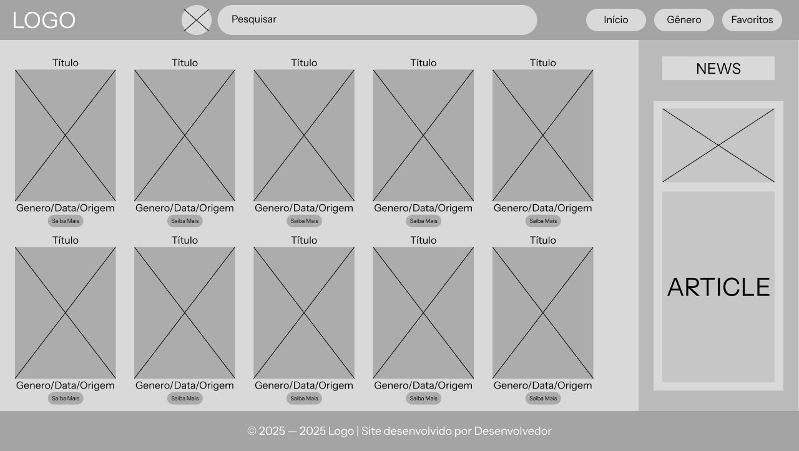

**Lucas Santiago Pereira - 897498**

**Projeto Escolhido: Catálogo de Filmes**

**Contexto da Aplicação**

O catálogo de filmes permite aos usuários explorarem uma lista de filmes populares, com informações como título, sinopse, elenco e trailer. O sistema pode integrar uma API pública (como The Movie Database) para obter dados atualizados sobre os filmes.

 
**Funcionalidades Esperadas**

- Página inicial com destaques de filmes populares.
- Página de listagem de filmes com filtros por gênero e ano.
- Página individual para cada filme, incluindo sinopse, elenco, trailer incorporado e avaliações.
- Integração com API de filmes permitindo encontrar filmes pelo título.
Botões para favoritar filmes e criar uma lista personalizada.

 
**Componentes de Front-End e Elementos Visuais**

- Navbar fixa com opções de categorias e pesquisa.
- Grid responsivo com cartazes dos filmes.
- Página de detalhes do filme com trailer incorporado.
- Botão de “Curtir” ou “Favoritar” para adicionar à lista personalizada.

WireFrame - Catálogo de Filmes

Projeto que consiste em uma página web onde será apresentado um catálogo de filmes. Com uma logo, barra de pesquisa, um menu para facilitar a navegação por gênero, data de lançamento, últimas novidades sobre filmes e um catálogo onde serão apresentados os novos lançamentos.